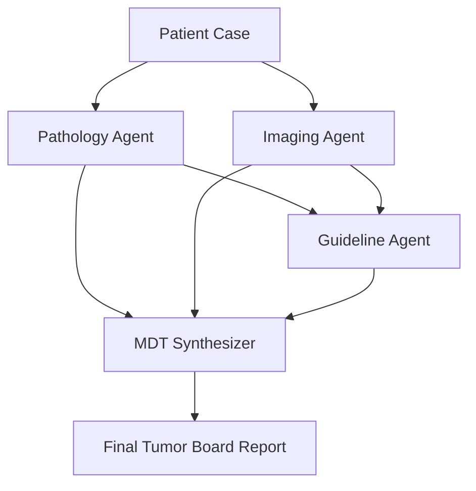

# System Architecture: Autonomous Tumor Board (ATB)

ATB is built on a **Modular Agentic Multi-Agent Framework** designed to handle unstructured medical data and synthesize it into clinical draft reports.

## 1. Multi-Agent Orchestration Flow

The system employs a sequential pipeline where downstream agents benefit from the structured outputs of upstream specialists.



### Specialist Agents
- **Pathology Agent (Agent A)**: Utilizes `utils/pathology_processor.py` (OpenCV) to analyze cellularity.
- **Imaging Agent (Agent B)**: Utilizes `utils/imaging_processor.py` (pydicom) for radiological feature extraction.
- **Guideline Agent (Agent C)**: Employs a **Semantic RAG Engine** (`utils/rag_engine.py`) to search over medical guidelines.
- **MDT Synthesizer (Agent D)**: Uses a **Reasoning Engine** (`utils/synthesis_engine.py`) to aggregate findings and flag conflicts.

## 2. Core Technical Components

### A. Semantic RAG Engine
Unlike keyword search, our RAG engine uses:
- **Embeddings**: `all-MiniLM-L6-v2` via Sentence-Transformers.
- **Vector Store**: `FAISS` index for O(1) semantic lookups.
- **Grounding**: All treatment options linked to evidence levels in `knowledge_base/guidelines.json`.

### B. Imaging & Vision Pipelines
- **DICOM Processing**: Direct metadata and pixel-array access using `pydicom`.
- **Morphology Analysis**: Nuclei density and tissue atypia quantification via `OpenCV` histograms and contour detection.

### C. Data Persistence Layer
- **SQL Backend**: SQLite managed via `SQLAlchemy`.
- **Validation**: Strict `Pydantic v2` schemas enforce data hygiene between agents.

## 3. Directory Structure

```text
d:/Autonomous-Tumor-Board
├── agents/            # Specialized agent logic
├── orchestrator/       # Multi-agent coordination
├── models/             # Pydantic & SQLAlchemy models
├── utils/              # Heavy processing (RAG, CV, DICOM)
├── knowledge_base/     # Grounded medical data
├── data/               # Persistent storage (DB, Uploads, Reports)
├── api.py              # FastAPI Backend
└── app.py              # Streamlit Frontend
```

## 4. Conflict Detection Logic
The MDT Synthesizer implements a weighted reasoning path that checks for:
1. **Size Mismatch**: Flags discrepancies >1.5cm between imaging and pathology.
2. **Staging Conflicts**: Discrepancies between nodal spread and primary mass size.
3. **Confidence Aggregation**: Weighted score calculated from all agents to determine overall report reliability.
